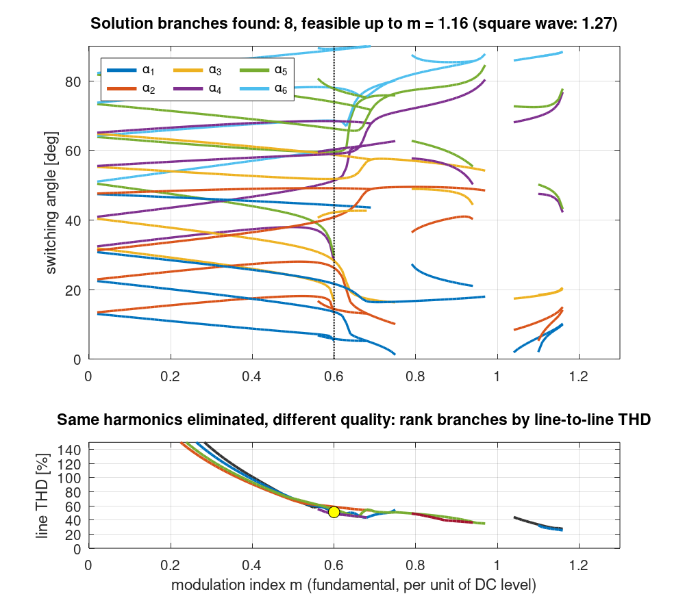
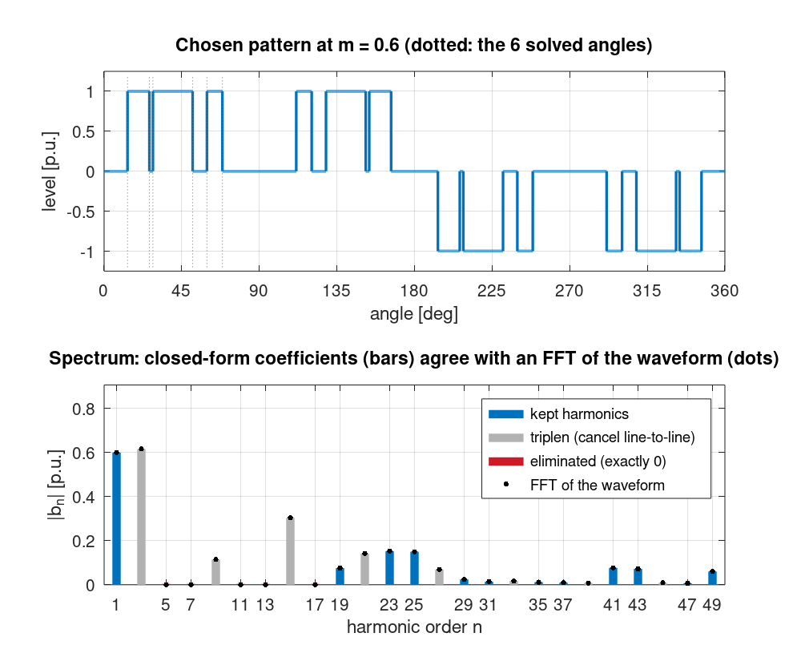
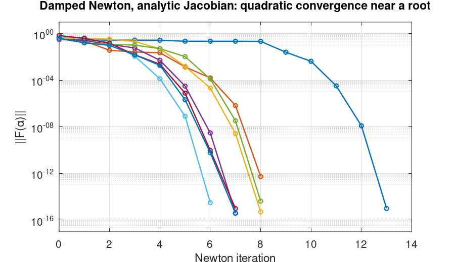

# SHE Angle Solver (MATLAB / Octave)

Computes the switching angles for **Selective Harmonic Elimination (SHE)**: choose $N$ angles so a three-level PWM waveform has a set fundamental and **exactly zero** amplitude at $N-1$ chosen harmonics. The original use was the PWM line current of a current-source inverter (CSI), eliminating the 5th, 7th, 11th, 13th and 17th harmonics with 6 angles.

v2 adds a toolbox-free Newton solver with an **analytic Jacobian**. It also maps out the **solution branches** across the whole modulation range by continuation, and ranks them by line-to-line THD and minimum pulse width.



---

## Problem

A PWM converter switching only a few times per cycle produces large low-order harmonics, and those need physically big and expensive filters. SHE places the switching instants so that chosen harmonics cancel exactly. That gives a nonlinear system of equations with several solutions or none, depending on the target fundamental. A practical solver has to:

- converge reliably and fast,
- find *all* the solution families, not just the one nearest a guess,
- reject solutions that can't be built (angles out of order, or pulses too narrow for the switches).

## Method

With quarter- and half-wave symmetry, the waveform over the first quarter period is 0 until $\alpha_1$, then +1 until $\alpha_2$, then 0 until $\alpha_3$, and so on. Its Fourier sine coefficients, per unit of the DC level, are

$$b_n(\alpha) = \frac{4}{n\pi}\sum_{k=1}^{N}(-1)^{k-1}\cos(n\alpha_k), \qquad n \text{ odd.}$$

The SHE equations and their Jacobian, which is analytic and cheap to compute, are

$$F(\alpha) = \begin{bmatrix} b_1(\alpha) - m \\ b_{h_1}(\alpha) \\ \vdots \\ b_{h_{N-1}}(\alpha)\end{bmatrix} = 0, \qquad \frac{\partial b_n}{\partial \alpha_k} = -\frac{4}{\pi}(-1)^{k-1}\sin(n\alpha_k).$$

- **Solver (`she_solve`).** Newton steps $d = -J^{-1}F$ with a backtracking line search on $\|F\|$. If $J$ is close to singular, it takes a Levenberg-Marquardt step instead. No Optimization Toolbox and no `fsolve` is needed.
- **Feasibility.** A root of $F$ is only a usable pattern if $0 < \alpha_1 < \dots < \alpha_N < \pi/2$. `she_min_pulse` also reports the narrowest pulse, because real switches have a minimum on/off time/delay.
- **Branch map (`she_sweep`).** First, a multi-start search finds solutions at seed values of $m$. The starting guesses come from a Halton sequence, which spreads points evenly and uses no random numbers, so MATLAB and Octave give identical results. Then natural-parameter continuation traces each solution along $m$, using a secant predictor as the next Newton starting guess. Starting guesses alone rarely land near the edges of the feasible range: at $m$ = 0.6, only 25 of 200 reached a feasible solution. Continuation follows each branch there smoothly.
- **Ranking (`she_line_thd`).** In a balanced three-wire system the triplen harmonics cancel between phases, so patterns are compared on the THD of the **line-to-line** waveform.

## Results (6 angles; eliminate 5, 7, 11, 13, 17)

- **8 solution branches found**, with feasible patterns up to **m = 1.16** (the full square wave would be $4/\pi$ = 1.27). A search with three times as many starting points found the same 8.
- At **m = 0.6** the branches give very different patterns for the same eliminated harmonics:

| Branch | Line THD | Narrowest pulse |
|---|---|---|
| 1 | 51.0 % | 1.63° (pulse too narrow) |
| 2 | **51.1 %** | **2.05°** <- chosen: lowest THD with pulses ≥ 2° |
| 3 | 58.6 % | 2.20° |
| 4 | 55.2 % | 7.19° (most robust to switching-time limits) |
| 5 | 48.3 % | 1.45° (lowest THD, but pulse too narrow) |

- The v1 starting guess `[10 20 30 40 50 60]°` converges in 10 iterations to the branch 1 solution. That solution is exact, but its 1.63° pulse is the kind of problem v1 had no way to flag.





## Validation

- **Independent spectrum check.** `she_waveform` builds the pattern directly from its definition, and its FFT is compared with the closed-form $b_n$. They agree to around 1.5e-4 for every odd $n \le 49$, which is the FFT's sampling resolution. Eliminated harmonics come out at round-off level: below the solver tolerance of 1e-12, and about 3e-16 for the pattern shown.
- **Jacobian check.** The analytic Jacobian matches central finite differences to a relative error below 1e-8.
- **Quadratic convergence.** The residual sequence from the v1 guess ends 1.3e-3 -> 1.9e-5 -> 4.1e-10 -> 2.6e-16: each error is roughly the square of the one before, as Newton theory predicts.
- **Known result.** The line-THD routine reproduces the six-step value $\sqrt{\pi^2/9-1}$ = 31.08 %.
- **Backward compatibility.** `SHE_Solver` gives exactly the published v1 residual (the v1 code is kept verbatim in `tests/reference/`).
- **9 unit tests** run on every push via GitHub Actions (GNU Octave).

## Limitations

- **Natural-parameter continuation stops at folds** (turning points in $m$), which is where branches appear to end in the map. Pseudo-arclength continuation would trace through them.
- **Multi-start is not proof of completeness.** More branches may exist that no starting guess found. A lighter search finds fewer: an earlier version of this repo searched less and reported only 4. To recheck, set `heavy_check = true` in `make_figures.m` (roughly 5 minutes in Octave).
- **Ideal model.** Switching is instantaneous, with no dead time or commutation overlap. For a real CSI, the line-current pattern must also satisfy the converter's gating constraints (which depend on the IGBT and switch paramaters), which are outside the limits of the solver.
- **Possible next steps:** optimise the remaining harmonics (minimise the weighted THD) rather than just eliminate a set, and maybe add pseudo-arclength continuation.

## How to run

Requires MATLAB R2019b+ **or** GNU Octave 8+. No toolboxes.

```matlab
addpath src
H = [5 7 11 13 17];                                 % harmonics to eliminate
[alpha, info] = she_solve(0.6, H, [10 20 30 40 50 60]*pi/180);
alpha_deg = alpha * 180/pi

branches = she_sweep(0.02:0.01:1.27, H);            % map the solution branches
```

```matlab
run('examples/demo_v1_problem.m')   % the v1 problem in amps (I_dc = 200 A, I_1 = 120 A)
run('examples/make_figures.m')      % regenerates every figure and number above (~2 min in Octave)
cd tests; run_tests                 % 9 tests
```

| Function | Purpose |
|---|---|
| `she_solve(m, H, alpha0)` | Damped Newton solve; returns angles + convergence/feasibility info |
| `she_sweep(m_grid, H)` | Multi-start + continuation map of the solution branches |
| `halton_points(idx, d)` | Deterministic, evenly spread starting points (identical in MATLAB and Octave) |
| `she_harmonics(alpha, n)` | Closed-form harmonic amplitudes |
| `she_residual`, `she_jacobian` | The equations and their analytic Jacobian |
| `she_waveform(alpha)` | Sampled waveform (for FFT checks and plots) |
| `she_line_thd(alpha)` | THD of the line-to-line waveform |
| `she_min_pulse(alpha)` | Narrowest pulse or notch |
| `SHE_Solver(alpha, I_dc, I_1)` | v1 residual function, unchanged output |

## Changes from v1

- **Fixed:** the v1 README called `SHE_nonlinear_system_with_jacobian`, but MATLAB looks functions up by *file* name (`SHE_Solver.m`), so the example failed with "Undefined function". `SHE_Solver` now has a matching name, and the example uses the new API.
- **Fixed:** the function was named "with_jacobian" but was missing the main Jacobian.m. v2 has an analytic one which I forgot to upload the last time.
- **Added:** a toolbox-free solver, feasibility and pulse-width checks, the branch map, THD ranking, FFT validation and tests.

## Context

A personal project from my power-electronics work, rewritten in a cleaner, tested form as part of logging my code. Solo work.

## License

MIT, see [LICENSE](LICENSE).
